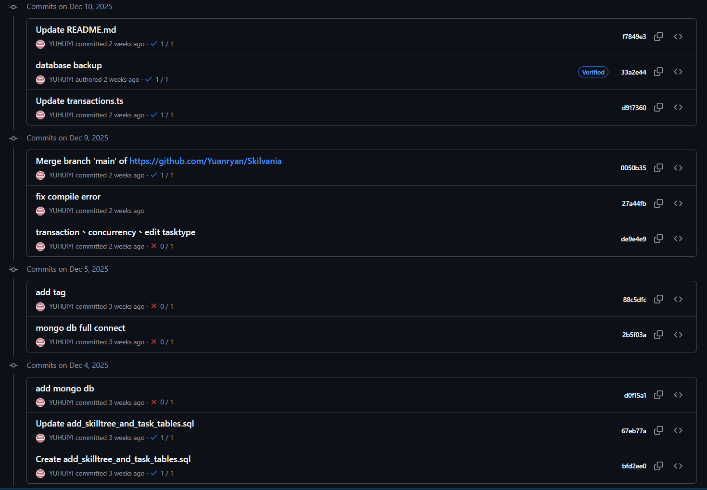

# [114-1] Web Programming Final Project

(Group 17) Skilvania - 冒險式技能學習與知識交換平台

成員：資管三 陳宥安、丁崇耘、林祐亨

## 一、Demo 影片：

https://youtu.be/WDgYAMChdZk

## 二、Deployed 連結：

https://skilvania.vercel.app


## 三、專案簡介

Skilvania 是一個結合 「知識共生」 概念的互動式學習平台。我們將枯燥的課程列表轉化為一片生機蓬勃的「知識森林」，讓每一位使用者既是探索世界的學習者，也是培育森林的領路人。透過視覺化的「技能樹」系統與智慧媒合機制，使用者可以輕鬆交換彼此的專長、分享獨到的見解，並在共同解鎖節點（Nodes）的過程中建立深度的社群連結。在 Skilvania，學習不再是孤獨的攀爬，而是一場全員參與、互助共享的冒險旅程。

## 四、系統功能說明

（一）註冊與登入
*   支援 Email/Password 註冊與登入。
*   支援 Google OAuth 快速登入。
*   整合 NextAuth.js v5 進行安全驗證。

（二）冒險式學習流程（學習者）
*   **技能森林視覺化**：首頁以動態生長的樹狀結構展示學習路徑，透過滾動動畫呈現知識的演進與分支。
*   **節點闖關機制**：課程被拆解為具備不同難度級別的「知識節點」，隨著探索進度解鎖更高階的內容。
*   **遊戲化成長指標**：完成學習活動可獲得經驗值（XP），提升個人等級，將成長過程數據化與趣味化。

（三）全民創作者與知識共享（分享者）
*   **去中心化知識貢獻**：平台鼓勵每一位使用者分享專長，將自己的經驗轉化為可被探索的技能樹。
*   **區塊編輯器（Block Editor）**：提供極簡且強大的創作工具，支援 Markdown、程式碼區塊、數學公式（KaTeX），讓分享知識變得直覺且精美。
*   **路徑規劃工具**：創作者可以自由設計非線性的學習地圖，引導他人走入特定的知識領域。

（四）技能交換與社群互動
*   **智慧夥伴媒合**：系統根據使用者的學習興趣與專長，分析「互補性」並推薦適合的學習夥伴（Study Buddies），促進技能交換。
*   **讀書會與討論區**：使用者可建立特定主題的讀書會，與同好即時交流心得，在互動中產生新的靈感與知識碰撞。
*   **即時互動訊息**：支援解鎖夥伴聯絡方式、發送訊息，讓線上的知識流動轉化為真實的人際連結。

（五）個人化儀表板
*   展示等級、累積 XP 與近期活動日誌。
*   整合社群動態，即時追蹤夥伴的學習進度與新發布的知識節點。

## 五、使用技術與框架

**前端：**
*   Next.js 16 (App Router)
*   React 19
*   Tailwind CSS 4
*   Framer Motion 12
*   React Markdown & KaTeX

**後端與資料庫：**
*   Next.js Server Actions
*   Supabase (PostgreSQL)

**驗證與工具：**
*   NextAuth.js v5 (Beta)
*   Zustand
*   Zod

## 六、成員心得

**資管三 陳宥安：**
這次的主題是我發想的，主要是因為之前在準備面試的時候被各種 open source 的資源幫助到，讓我也想做一個相關的東西回饋社會的感覺。這次做的專案規模算蠻大的，而且因為大部分都是 ai 寫的 code，在追蹤整個專案或甚至只是一個 feature 部份的問題都讓我十分痛苦。讓我覺得用 ai 寫專案其實沒有想的那麼輕鬆。

**資管三 丁崇耘：**
這次的專案 Skilvania 應該是我做過前幾大的專案，實作了非常多的功能，過程雖然有時候很痛苦，但也非常的有成就感。在過程中我們大量使用AI，但卻也讓我發覺使用AI的上限就是使用者本身，就算有AI，還是要精進自己才能成為好的開發者。我還有一個體悟是UIUX真的是一條無止盡的路，改完一個東西之後就會有四、五、六個想要優化的東西跑出來，從此開始非常尊敬每個UIUX設計師。

**資管三 林祐亨：**
我們在這次的專案 Skilvania 實作出了一個分享、紀錄興趣、技能、經驗的平台，這些內容主要以課程的形式供使用者瀏覽。我在上架課程的過程中，發現這種把知識內化後分享給其他人的感覺很好，如果系統未來有機會上線，看到陌生人對自己課程的評論、評分，也許會有更大的動機上架更多課程。

---

## 七、地端測試與開發指引

為確保專案能在地端 (localhost) 順利執行，請參考以下步驟進行環境設定：

### 1. 複製專案與安裝依賴
```bash
git clone <repository-url>
cd Skilvania
npm install
```

### 2. 環境變數設定
請於根目錄建立 `.env.local` 檔案，並填入必要資訊。可以參考 `env.example`：

**必要變數：**
```env
# Supabase Configuration
NEXT_PUBLIC_SUPABASE_URL=https://your-project-id.supabase.co
NEXT_PUBLIC_SUPABASE_ANON_KEY=your-anon-key-here
SUPABASE_SERVICE_ROLE_KEY=your-service-role-key-here

# NextAuth Configuration
NEXTAUTH_SECRET=your-generated-secret-here
NEXTAUTH_URL=http://localhost:3000
```

### 3. 資料庫設定 (Supabase)
1. 前往 [Supabase](https://supabase.com) 建立專案。
2. 在 SQL Editor 中執行 `supabase/schema.sql` 以建立核心資料表。
3. 若需啟用社群功能，可執行 `supabase/community_schema.sql`。

### 4. 啟動開發伺服器
```bash
npm run dev
```

---


## 八、成員分工
* 林祐亨：lesson editor, 初始系統架構, 課程生成與撰寫

* 丁崇耘：user profile, community, message, explore, landing page, 登入, 課程生成與撰寫

* 陳宥安 : lesson learning 介面, 初始系統架構, lesson editor 優化, dashboard, 課程生成與撰寫

* 游輝毅（外掛） : 與我們一起製作「資料庫管理」這門課的專案，有參與討論，但實作方面主要負責撰寫報告和anylitic頁面(在本門課最後的展示成果中沒有用到），因此我們認為跟本門課的關係其實不大。
Commit History :

都是跟資料庫相關的紀錄，後續資料庫有重新設計過，所以與這堂課的關聯不大。